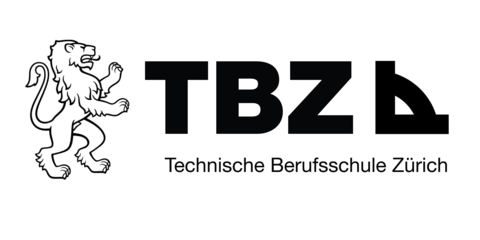

# SemArb5_GameLobby

Hallo, dieses Repository wurde erstellt, um die Semesterarbeit von Marco Kälin für das 5te Semester zu begleiten.

Im Lehrgang "Informatiker HF - Cloud Native Engineer" von der Technischen Berufsschule Zürich, wird jedes Semester von den Studenten eine Semesterarbeit verlangt. Dies ist eine dieser Semesterarbeiten.

[Quelle Bild - TBZ Logo](docs/anhang/600-quellen.html#611-tbz-logo)

Für konstruktive Kritik steht jederzeit der Issues Tab offen.
