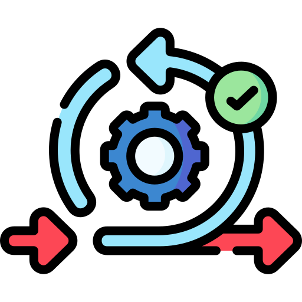

# 4. Sprints und Scrum Meetings

In diesem Abschnitt werden wir die Sprints genauer anschauen und unsere Erkenntnisse beschreiben. Da wir als Gruppe arbeiten werden die Sprints in Scrum Meetings besprochen. Die Daten für die Meetings haben wir bereits beschlossen und können hier eingesehen werden.

{: width="250px" }

[Quelle Bild - Icons](../anhang/600-quellen.html#64-icons)
