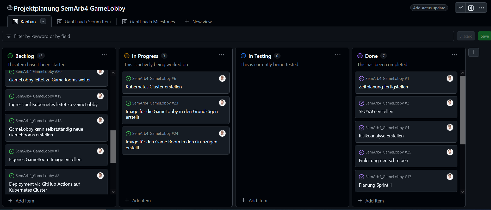
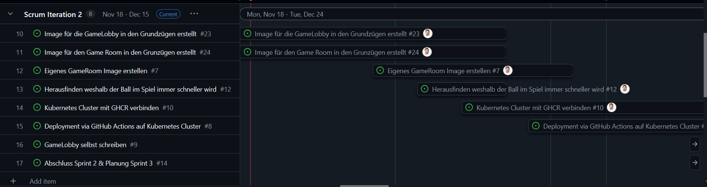

# 4.1 Sprint 1

Hier sind die Erkenntnisse des ersten Sprints.

{: style="width: 220px" }

[Quelle Bild - Icons](../anhang/600-quellen.html#64-icons)

[Geplant wurde der erste Sprint in diesem Task in GitHub Projects.](https://github.com/Euthal02/SemArb4_GameLobby/issues/17)

## Was ist gut gelaufen? Was konnte bereits erreicht werden?

Ich konnte mithilfe meiner Mitstudenten einen guten Weg finden um einen Kubernetes Cluster aufzubauen. Dabei konnte ich neue Tools kennenlernen und altes Wissen vertiefen. Der Zeitplan ist diesmal besser gestaltet und erlaubt mir, mich besser mit den Themen zu befassen.

Zusätzlich habe ich mich bei einigen Modulen entschieden, meinen Fokus mehr auf die Semesterarneit zu schieben. Dies erlaubt mit weitere Kapazität um diese umzusetzen.

## Was hat nicht funktioniert? Was war nicht gut? Welche Aspekte sollen entfallen?

Ich hatte immense Schwierigkeiten ein Projekt zu finden und einen guten Einstiegspunkt zu finden. Mittels mehreren Revisionen mit Phillip Rohr, konnte ich dies aber (meiner Meinung nach) gut korrigieren.

## Was soll aufgrund der gemachten Erfahrungen ausprobiert werden?

Ich möchte weiterhin in kurzen Abständen ein grosses Feedback einholen. Ich habe gemerkt, dass mir dies vor allem im Anfangsstadium hilft das Projekt auf bessere Wege zu leiten.

## Erledigte Tasks des letzten Sprints?

- Die Dokumentationseinleitung ist komplett:
  - SEUSAG
  - Risikoanalyse
  - Zielsetzung
  - Zeitplanung
- Eigene Branches und Pipelines für Teilprojekte erstellt.
- Kubernetes Cluster begonnen aufzubauen.

## Momentaufnahme Backlog / Projektstatus

Das Backlog ist mit 15 Tasks relativ klein, für so ein frühes Stadium des Projekts. Dies deutet für mich darauf hin, dass die Tasks evtl. noch nicht genügend aufgesplittet sind.

Im nächsten Sprint werde ich also versuchen die Tasks weiter aufzuteilen.

## Warum ist der kommende Sprint wichtig?

Im nächsten Sprint werde ich damit beginnen MVPs von der GameLobby und dem GameRoom auf den Kubernetes Cluster zu deployen. Es wird noch nicht in der vollendeten Versionen sein, aber erste Grundzüge sollten dann bereits verfügbar sein.

## Was muss ich tun, um das Sprintziel zu erreichen?

Das bedeutet für mich vorallem viel Programmierarbeit. Der GameRoom und die GameLobby sind beide noch nicht vorhanden und müssen erstellt werden. Nach dem 80/20 Prinzip, werde ich eine Basisversion wohl im nächsten Sprint noch schaffen.

## Blick auf den 2. Sprint

Hier sind alle noch offenen Tasks des zweiten Sprints.
