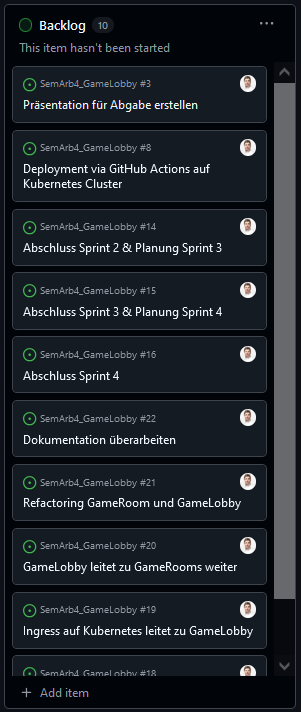
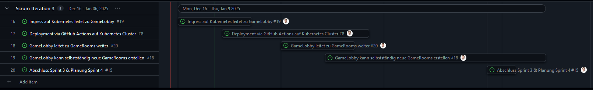

# 4.2 Sprint 2

Hier sind die Erkenntnisse des zweiten Sprints.

{: width="220px" }
{: width="220px" }

[Quelle Bild - Icons](../anhang/600-quellen.html#64-icons)

## Was ist gut gelaufen? Was konnte bereits erreicht werden?

Ich konnte im zweiten Sprint sehr gut vorankommen und habe für den GameRoom und die GameLobby ein MVP erstellt. Für die letzten Tests ist mir jedoch aufgefallen, dass die Produktiv Umgebung noch nicht ganz miteinander harmoniert. Lokal funktioniert jedoch alles sehr gut. Das ganze EKS Setup konnte ich automatisieren und durch die konstante Löschung und Wiederaufbauung des Cluster konnte ich Kosten sparen.

Die Images konnte ich sehr gut auf den Cluster deployen mit Helm. Das ganze ist noch nicht ganz ausgereift um in die Pipeline integriert zu werden. Aber ich habe somit also bereits einen guten Weg um das ganze zu deployen.

Die Entwicklung verlief sehr gut, ich konnte grosse Fortschritte erreichen und meine Ziele einfach erreichen. Bezüglich der Arbeitsweise benötigt es also keine Änderung.

## Was hat nicht funktioniert? Was war nicht gut? Welche Aspekte sollen entfallen?

Wie bereits erwähnt, ist die Pipeline noch nicht ganz ausgereift. Auch die Zusammenarbeit zwischen dem Room und der Lobby funktioniert in der Produktivumgebung noch nicht wie gewollt. Das ganze benötigt noch einiges an Entwicklung.

## Was soll aufgrund der gemachten Erfahrungen ausprobiert werden?

Ich möchte gerne weiterarbeiten so wie bisher.

## Erledigte Tasks des letzten Sprints?

Ich konnte die folgenden Tasks erledigen. Mehr Infos zu den einzelnen Tasks finden sich in den angefügten Links:

* [Kubernetes Cluster mit GHCR verbinden](https://github.com/Euthal02/SemArb4_GameLobby/issues/10)
* [GameLobby selbst schreiben](https://github.com/Euthal02/SemArb4_GameLobby/issues/9)
* [Eigenes GameRoom Image erstellen](https://github.com/Euthal02/SemArb4_GameLobby/issues/7)
* [Image für die GameLobby in den Grundzügen erstellt](https://github.com/Euthal02/SemArb4_GameLobby/issues/23)
* [Image für den Game Room in den Grunzügen erstellt](https://github.com/Euthal02/SemArb4_GameLobby/issues/24)

## Momentaufnahme Backlog / Projektstatus

Ich habe noch 10 Tasks offen. Dies sind 5 Tasks weniger als beim letzten Sprint. Dies ist ein guter Fortschritt.

## Warum ist der kommende Sprint wichtig?

Im kommenden Sprint möchte ich das Zusammenspiel zwischen der Lobby und dem Room verbessern. Auch möchte ich damit beginnen das ganze in der Pipeline zu deployen. Dies erleichtert es mir das ganze zu finalisieren.

## Was muss ich tun, um das Sprintziel zu erreichen?

Ich muss weiterhin so arbeiten wie bisher und mich an den Zeitplan halten und die Tasks abarbeiten. Wenn das ganze so weiterläuft wie im letzten Sprint, sehe ich das sehr positiv.

## Blick auf den 3. Sprint

Hier sind alle noch offenen Tasks des dritten Sprints.
