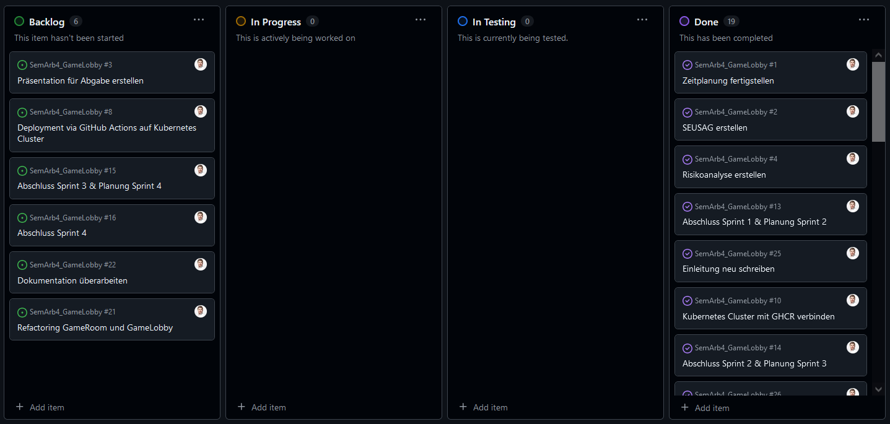
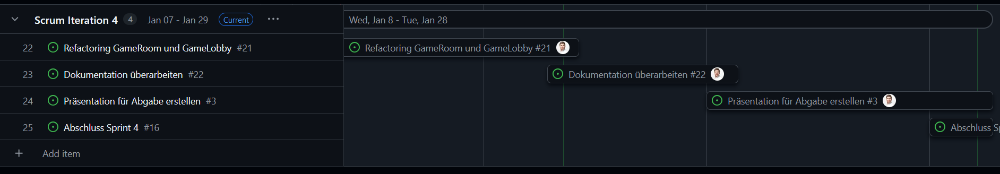

# 4.3 Sprint 3

Hier sind die Erkenntnisse des dritten Sprints.

{: width="220px" }
{: width="220px" }
{: width="220px" }

[Quelle Bild - Icons](../anhang/600-quellen.html#64-icons)

## Was ist gut gelaufen? Was konnte bereits erreicht werden? ## Was hat nicht funktioniert? Was war nicht gut? Welche Aspekte sollen entfallen?

Wie bereits im vorherigen Sprintabschluss vermerkt, ging es bei diesem Sprint vor allem um das Zusammenspiel von der Game Lobby und dem Game Room. Dies ist mir sehr gut gelungen und funktioniert hervorragend. Ich musste leider aus Zeitgründen, davon absehen, der Lobby zu erlauben selbstständig neue Rooms zu erstellen, sondern stelle einfach direkt 10 Rooms bereit. Ich habe einige Studnen damit investiert, dies zu erstesten, konnte jedoch kein PoC erreichen. Somit habe ich diesen Teil abgebrochen und mich für einen statischen Weg entschieden,

Die 10 Rooms sind alle eigenständig und kooperieren mt der Lobby über ein Punktesystem. Das Punktesystem funktioniert und wird über alle Rooms gebroadcastet. Es besteht aber noch weiterhin das Problem, dass die Punkte resetted werden, wenn ein Room verlassen wird. Jeder Spieler sieht auch die Punkte anderer Spieler in anderen Räumen.

Zeitlich hatte ich diesen Sprint wieder ein bischen mehr Probleme. Dies aus dem Grund, da die Festtage waren. Die bevorstehenden Tasks waren jedoch alle kleiner von Natur aus und so konnte ich jetzt auf den Sprintabschluss doch noch einiges erledigen.

Die Dokumentation hat sich noch nicht wirklich weiterentwickelt, sondern ist ein bsichen stagniert. Ich habe viel Zeit für Testing und nur wenig für den Fortschritt aufgewendet. Bis zum Projektabschluss sollte dies aber noch gemacht werden.

## Was soll aufgrund der gemachten Erfahrungen ausprobiert werden?

Ich bin auf einem guten Weg, dass Produkt gut abzuliefern und möchte gerne weiter so arbeiten. Die zeitlichen Probleme sind nun nach den Festtagen vorbei und ich kann mich wieder auf die Arbeit fokussieren.

## Erledigte Tasks des letzten Sprints?

* [GameLobby kann selbstständig neue GameRooms erstellen](https://github.com/Euthal02/SemArb4_GameLobby/issues/18)
* [Deployment via GitHub Actions auf Kubernetes Cluster](https://github.com/Euthal02/SemArb4_GameLobby/issues/8)
* [Die Weihnachtspause](https://github.com/Euthal02/SemArb4_GameLobby/issues/26)
* [GameLobby leitet zu GameRooms weiter](https://github.com/Euthal02/SemArb4_GameLobby/issues/20)
* [Ingress auf Kubernetes leitet zu GameLobby](https://github.com/Euthal02/SemArb4_GameLobby/issues/19)

## Zieleprozentsatz

* Die Game Lobby funktioniert Browser basiert. --> zu 100% erreicht.
* Die Game Lobby und der Game Room werden automatisiert von einer CI/CD Pipeline deployt. --> zu 100% erreicht.
* Neue Versionen werden automatisch getestet. --> noch nicht erreicht, Testing noch nicht umgesetzt.
* Das ganze soll auf Kubernetes gehostet werden. (Grundanforderung der Semesterarbeit) --> zu 100% erreicht.
* Die Lobby skaliert automatisch anhand der Anzahl Spieler und erstellt neue “Rooms”. --> nicht mehr verfolgt, die Rooms sind eine statische Anzahl.
* Bereits vorhandene “Pong” Spiele für die Rooms einsetzen. --> konnte ich nicht umsetzen. Kein kompatibles Projekt vorhanden.

## Momentaufnahme Backlog / Projektstatus

Ich habe hier einen Screenshot des Backlogs angehängt.

Offen sind noch 6 Tasks.

## Warum ist der kommende Sprint wichtig?

Im kommenden, letzten Sprint mache ich den gesamten Projekt Abschluss. Den ganzen Code werde ich nochmals überarbeiten und verbessern. Noch dazu hoffe ich, dass Testing zu etablieren und in der Pipeline umzusetzen. Ich werde diesen Sprint nutzen um das Projekt abzurunden und mit Erfolg abzuschliessen.

## Was muss ich tun, um das Sprintziel zu erreichen?

Ich muss wieder zurück auf meine Arbeitsmoral vor diesem Sprint kommen und mich wieder besser an die Zeitplanung halten. Ansonsten bin ich mit meiner Arbeitsmethodik zufrieden und komme meiner Meinung nach gut voran.

## Blick auf den 4. Sprint

Ich habe noch die folgenden Tasks offen:

