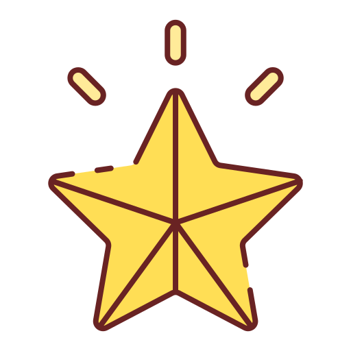

# 4.4 Sprint 4

Hier sind die Erkenntnisse des viertem Sprints.

{: style="width: 220px" }
{: style="width: 220px" }
{: style="width: 220px" }
{: style="width: 220px" }

[Quelle Bild - Icons](../anhang/600-quellen.html#64-icons)

## Was ist gut gelaufen? Was konnte bereits erreicht werden?

In diesem letzten Sprint, wollte ich die Rückmeldungen von den Lehrpersonen einfliessen lassen, welche sich in den letzten drei Sprints angesammelt haben. Ich bin der Meinung, dass mir dies einigermassen gut gelungen ist. In diesem Sprint konnte ich erreichen, dass mein Produkt Abgabe fertig ist.

## Was hat nicht funktioniert? Was war nicht gut? Welche Aspekte sollen entfallen?

Alles verlief nach Plan und ich kann keinen schlechten Aspekt nennen. In zukünftigen Arbeiten möchte ich gerne so weiter arbeiten wie bisher.

## Was soll aufgrund der gemachten Erfahrungen ausprobiert werden?

In zukünftigen Arbeiten möchte ich gerne so weiter arbeiten wie bisher.

## Erledigte Tasks des letzten Sprints?

* [Präsentation für Abgabe erstellen](https://github.com/Euthal02/SemArb4_GameLobby/issues/3)
* [Dokumentation überarbeiten](https://github.com/Euthal02/SemArb4_GameLobby/issues/22)
* [Refactoring GameRoom und GameLobby](https://github.com/Euthal02/SemArb4_GameLobby/issues/21)

## Abschluss

[Den Rückblick über das ganze Projekt, findet sich hier.](../schlussteil/500-schlussteil.html)
