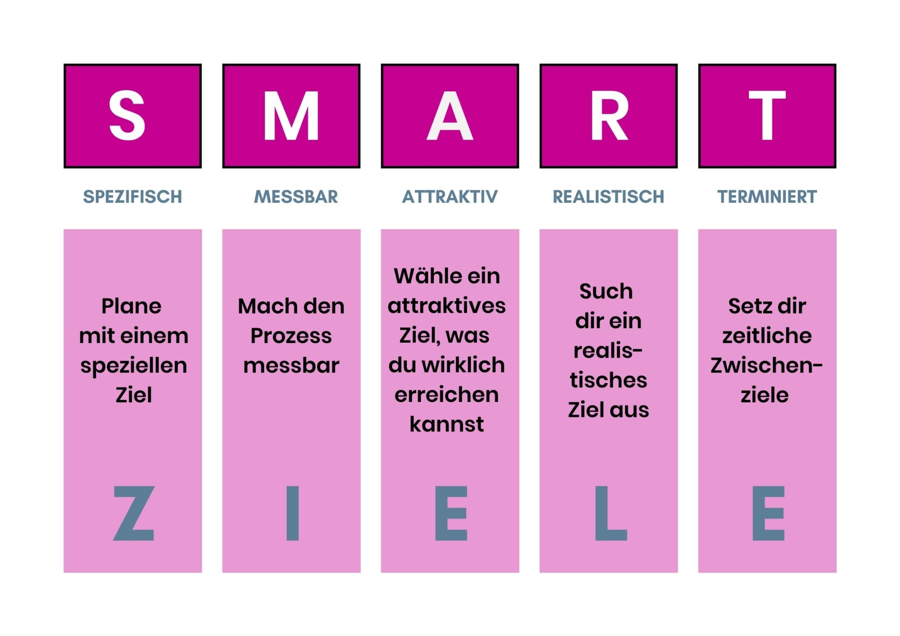

# 2.2 Ziele der Semesterarbeit

{: style="width: 250px"" }

[Quelle Bild - Icons](../anhang/600-quellen.html#64-icons)

Die Ziele dieser Arbeit sind möglichst nach dem SMART Prinzip erstellt.

{: style="width: 250px"" }

[Quelle Bild - SMART Prinzip](../anhang/600-quellen.html#613-smart-prinzip)

## Bis am Ende der Arbeit, sollten folgende Ziele erreicht sein

1. Die Game Lobby funktioniert Browser basiert.
2. Die Game Lobby und der Game Room werden automatisiert von einer CI/CD Pipeline deployt.
3. Neue Versionen werden automatisch getestet.
4. Das ganze soll auf Kubernetes gehostet werden. (Grundanforderung der Semesterarbeit)
5. Die Lobby skaliert automatisch anhand der Anzahl Spieler und erstellt neue "Rooms".
6. Bereits vorhandene "Pong" Spiele für die Rooms einsetzen.
