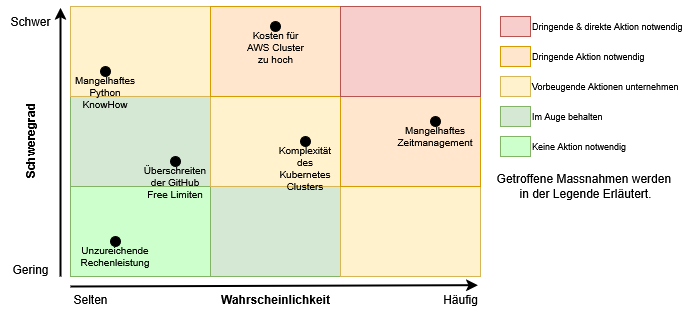

# 2.3 Risiken

Zu diesem Projekt wurde eine Risikomatrix erstellt. Die Risiken stellen Stolpersteine in der Erreichung der vorhin erstellten Ziele dar. Falls das Risiko wahrscheinlich und / oder einen hohen Schweregrad hat, werden Massnahmen dagegen ergriffen. Die meisten Ziele sind identisch zum letzten Projekt. Dies macht auch Sinn, da es im Grunde genommen dasselbe Projekt ist.

Wie man gut sehen kann, gibt es einige Risiken, welche man für die Arbeit identifizieren konnte. Zwei Risiken werden als Selten und mit einem mässigen Schweregrad eingeschätzt. Für diese beiden werden keine Massnahmen ergriffen, sondern diese werden einfach im Auge behalten.

Für vier Risiken wurde ein Bedarf für vorbeugende Massnahmen erkannt. Die vorbeugenden Massnahmen werden hier kurz erläutert:

* Mangelhaftes Python KnowHow

    Für das Python Know How Problem, kann man ganz einfach ChatGPT zu Hilfe ziehen. Mittels diesem Werkzeug kann jedes Problem ganz einfach kurz besprochen werden und man bekommt einen guten Ansatz für den weiteren Verlauf des Problems.

* Mangelhaftes Zeitmanagement

    Da dieses Projekt wohl den Rahmen für die 50 Stunden bei weitem überschreiten wird. Müssen die Arbeiten welche nach der 80:20-Regel die 80% des Outputs generieren werden, zuerst gemacht werden. Das bedeutet also, dass die grundlegenen Tasks / Features zuerst erledigt werden und erst anschliessend die kleineren Details. Ein MVP in allen Teilbereichen wird bevorzugt gegenüber einem perfekten Abschluss in nur einem Teilbereich.

* Komplexität des Kubernetes Clusters

    Als Basisanforderung der Arbeit ist dies ein wichtiger Punkt. Eine Kubernetes Instanz / ein Cluster kann aber sehr schnell einem über den Kopf wachsen. Um auch hier wiederum, den besten Output mit dem kleinsten Aufwand zu erzielen, wird für dieses Projekt ein "AWS Elastic Kubernetes Service" genutzt. Dies minimiert den Aufwand für den Cluster und erlaubt es, die Ziele der Arbeit besser zu verfolgen. Diese Strategie wurde auch schon beim letzten Projekt genutzt. Die vieles jedoch nicht so umgesetzt werden konnte wie gewünscht, wurde die Komplexität des Cluster erheblich reduziert. Bei diesem zweiten Anlauf könnte dies wieder zum Problem werden.

* Kosten für AWS Cluster zu hoch

    Wie erwähnt, wird dieses Projekt auf AWS umgesetzt. Dies bedeutet jedoch üblicherweise eine hohe Rechnung für diese Dienste. Mit den beiden Skripten `build.sh` und `destroy.sh` im [EKS Ordner](https://github.com/Euthal02/SemArb5_GameLobby_Improvement/tree/main/eks) wird das ganze aufsetzen und entfernen des Clusters automatisiert. Damit kann der Cluster immer entfernt werden und die Kosten damit gering gehalten werden.

Mit diesen Massnahmen sollte das Projekt besser für diesen Risiken geschützt sein.
