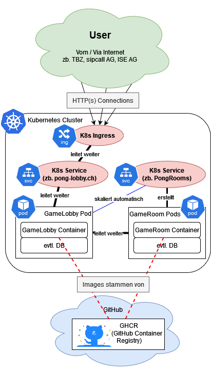
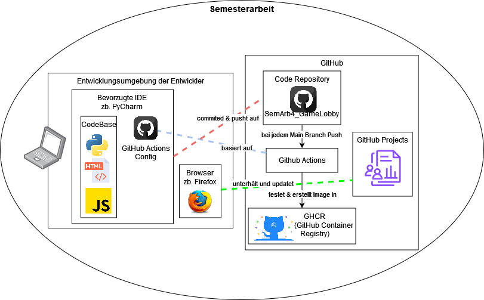

# 2.6 SEUSAG

Um die Systemabgrenzungen zu visualisieren, wurden zwei SEUSAGs erstellt.

Einmal mit dem technischen Ablauf des gewünschten SOLL Zustands und einmal mehr das ganze Organisatorische.

## Technisch

Im technischen SEUSAG wird Wert darauf gelegt, wie eine Connection von einem Benutzer genau durch das System hindurch geht. Ob die Technik dies auch wirklich so erlaubt, sei momentan aussen vor gelassen.

Der wichtige Punkt ist, dass die GameLobby einen weiteren Verteil-Layer darstellt, jedoch gleichzeitig auch nur ein Pod / Service ist.

Jegliche Images von Containern werden von der GitHub Container Registry bereitgestellt. Mehr dazu im Organisatorischen SEUSAG.

## Organisatorisch

Im Organisatorischen Teil wird beschrieben, wie die Entwickler genau an diesem Projekt arbeiten.

Darin wird dargestellt mit welcher CodeBase die Entwickler arbeiten, und wie das Repository auf GitHub aufgebaut ist.
