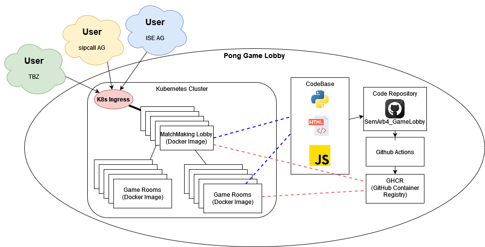

# 2.6 SEUSAG

Hier ist ein Diagram für die Systemabgrenzungen. Inklusive einer kleinen Legende.

Ich habe versucht darzustellen, dass es nicht darauf ankommt, wo genau ein User sitzt. Dieses Spiel sollte es jedem eraluben mit seinem Kollegen von überall zugreifen zu können.

Innerhalb meines "Pong Game Lobby"-Systems, gibt es den Kubernetes Cluster. Dieser empfängt jegliche Abfragen über den Kubernetes Ingress. Der Ingress sollte dann die Anfragen auf einen Matchmaking Cluster vertelen können. Die Matchmaker können dann wiederum an einzelne GameRooms verteilen.

Beide diese Images haben die gleiche CodeBase. Namentlich nutze ich Python, Javascript und HTML. Dies reicht bereits für mein einfaches Spiel.

Die CodeBase hoste ich auf GitHub in meinem Repository [(SemArb4_GameLobby)](https://github.com/Euthal02/SemArb4_GameLobby). Mit jedem Push auf den Main Branch wird eine GitHub Actions Pipeline gestartet, welche die beiden Images als Container Image auf die GHCR (GitHub Container Registry) pusht.

Von dort wird das Image wieder auf den Kubernetes Cluster deployt.
