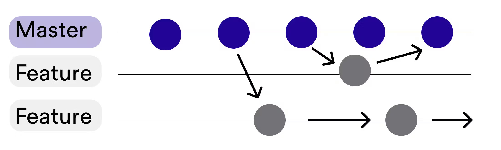

# 2.7 Git Branches Strategie

Für meine Branching Strategie verfolge ich einen Feature-based Ansatz.

Jedes Teilsystem, welches unabhängig von einem anderen ist, wird in einem separaten Branch verfolgt.

[Quelle Bild - Git Branches](../anhang/600-quellen.html#612-git-branches)

Der Main Branch dient als Zusammenfassung der vollendeten Features und als Dokumentations Platz.

Gleichzeitig ist der Main Branch, der einzige, welcher eine Pipeline integriert hat.

Solange ein Feature Branch nicht in den Main Branch gemerged wird, wird die Pipeline nicht ausgeführt.

[Mehr dazu im Kapital Pipelines.](./208-pipelines.html)
