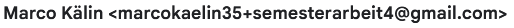
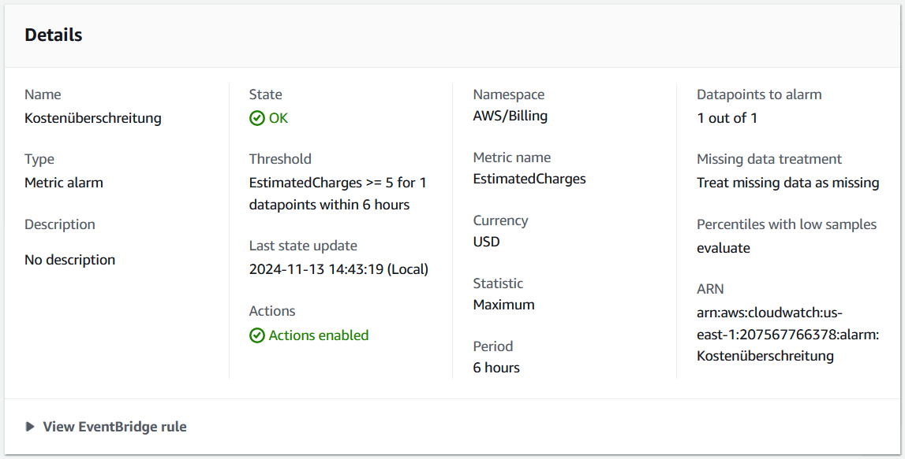
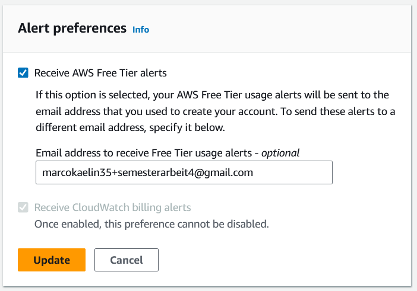
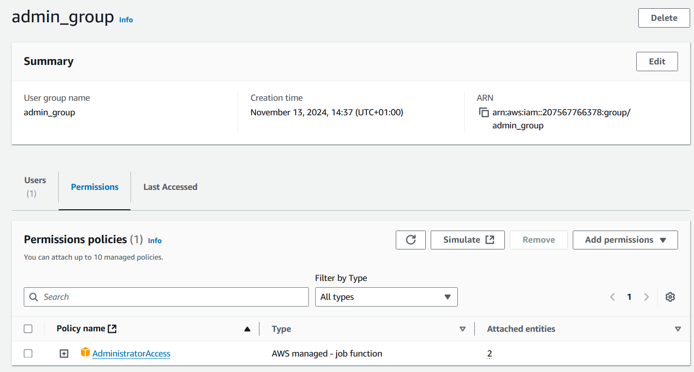

# 3.2 AWS Informationen

Das Projekt / die Arbeit ist auf der AWS Cloud gehostet.
Dies beinhaltet einige Eigenheiten dieser Cloud, welche hier augelistet und erklärt werden.

{: style="width: 250px" }

[Quelle Bild - AWS Logo](../anhang/600-quellen.html#614-aws-logo)

## EMail Alias

Da zu erwarten ist, dass dieses Projekt nach Abschluss des Semesters 24/25 nicht mehr von Marco Kälin unterhalten wird, wurde von ihm ein Alias aufgesetzt, welcher nach dieser Arbeit wieder gelöscht wird. Dies bedeutet auch, dass der AWS Account hinter diesem Alias nicht mehr wiederherstellbar sein wird.

Zukünftige Entwickler müssen also diesen Account migrieren, sollte dies notwendig sein.

{: style="width: 350px" }

## Billing Alerts

Um den AWS Account zu erstellen, wurde die Kreditkarte von Marco Kälin genutzt. Auch diese wird nach Abschluss dieses Semesters wieder entfernt, damit keine fälschliche Nutzung damit gemacht werden kann.

In der Zwischenzeit, wurde als Kostenabsicherung ein Billing Alert eingerichtet, womit Marco Kälin immer einen Überblick über die laufenden Kosten hat. Der Alert triggert sich selbst, sollte ein Datapoint (zb. EC2 als Service) mehr als 5 USD über 6 Stunden kosten.

{: style="width: 500px" }

Zusätzlich wurde ein Free Tier Alert aktiviert, sollte das Projekt in einem anderen BEreich aus dem Free Tier Bereich kommen, währe Marco Kälin also informiert und könnte Gegenmassnahmen ergreifen.

{: style="width: 500px" }

## IAM User

Da Marco Kälin dieses Projekt initiert hat, ist er momentan der einzige mit einem Zugang auf den Root-Account. Für die Entwickler, welche später dazu stossen könnten, wurde die Admin Gruppe erstellt. Sie erlaubt alles in der AWS Konsole, somit kann jeder Entwickler, mit einem Account jegliche Changes unternehmen. Sollte dieses Projekt grösser werden und die Organisation der Entwicklung kann nicht mehr auf Vertrauen basieren, wird dies geändert.

{: style="width: 500px" }
