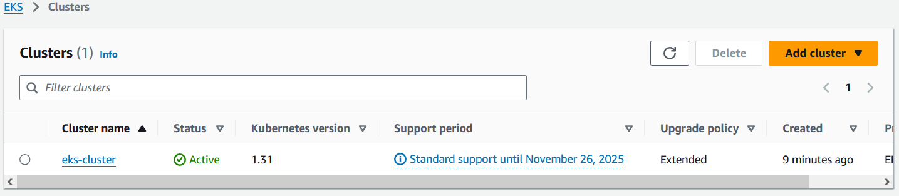

# 3.3 Cluster erstellen

Um den Cluster zu erstellen wird ein Account innerhalb der vorhin erwähnten "admin" Gruppe genutzt und ein Access Key erstellt.

Mit diesem Access Key kann anschliessend die lokale AWS CLI konfiguriert werden.

Als Standard Region wurde Zürich ausgewählt, dies aus Latenz Gründen.
Bei einem Spiel ist die Latenz von enormer Wichtigkeit.

```bash
mka@Tuxedo-Laptop:~$ aws configure
AWS Access Key ID [None]: **************
AWS Secret Access Key [None]: **************
Default region name [None]: eu-central-2
Default output format [None]: json
```

[Wie im Kapitel 3.1 erwähnt,](./301-kubernetes-cluster.md) nutzen wir das Tool `EKSCTL` um einen Cluster mittels wenigen Commands zu erstellen.

## Create Cluster

Im Script [eks/build.sh](https://github.com/Euthal02/SemArb4_GameLobby/blob/main/eks/build.sh) wurden Commands um einen Cluster mittels EKSCTL aufzubauen integriert. Man muss nur noch das Script ausführen und ein neuer Cluster wird erstellt.

Zuerst wird der Cluster erstellt. Die einzelnen Parameter basieren sich alle auf die Eigenschaften der "Nodegroup". Das bedeutet zusammengefasst, dass für den Cluster 2 Nodes (skalierbar auf 1 - 3 Nodes) erstellt werden, mit einen AmazonLinux auf einem m5.large Server. Jeder Node kann Pods hosten und ist per SSH erreichbar.

```bash
mka@Tuxedo-Laptop:~/repos/SemArb4_GameLobby$ eks/build.sh

# eksctl create cluster --name=eks-cluster --version=1.31 --region=eu-central-2 --node-ami-family=AmazonLinux2 --nodes=2 --nodes-min=1 --nodes-max=3 --ssh-access --ssh-public-key=semesterarbeit_admin_access --max-pods-per-node=20 --enable-ssm --with-oidc

2024-12-14 15:04:45 [!]  SSM is now enabled by default; `ssh.enableSSM` is deprecated and will be removed in a future release
2024-12-14 15:04:46 [ℹ]  eksctl version 0.194.0
2024-12-14 15:04:46 [ℹ]  using region eu-central-2
2024-12-14 15:04:46 [ℹ]  setting availability zones to [eu-central-2b eu-central-2c eu-central-2a]
2024-12-14 15:04:46 [ℹ]  subnets for eu-central-2b - public:192.168.0.0/19 private:192.168.96.0/19
2024-12-14 15:04:46 [ℹ]  subnets for eu-central-2c - public:192.168.32.0/19 private:192.168.128.0/19
2024-12-14 15:04:46 [ℹ]  subnets for eu-central-2a - public:192.168.64.0/19 private:192.168.160.0/19
2024-12-14 15:04:46 [ℹ]  nodegroup "ng-e1e84519" will use "" [AmazonLinux2/1.30]
2024-12-14 15:04:46 [ℹ]  using EC2 key pair "semesterarbeit_admin_access"
2024-12-14 15:04:46 [ℹ]  using Kubernetes version 1.30
2024-12-14 15:04:46 [ℹ]  creating EKS cluster "eks-cluster" in "eu-central-2" region with managed nodes
2024-12-14 15:04:46 [ℹ]  will create 2 separate CloudFormation stacks for cluster itself and the initial managed nodegroup
.............
.............
2024-12-14 15:17:35 [✔]  EKS cluster "eks-cluster" in "eu-central-2" region is ready

```

Dieser Schritt reicht bereits aus um eine funktionierende EKS Instanz zu hosten. Wie man sehen kann, wird die lokale Kubeconfig des Nutzers direkt mit einer neuen Config ergänzt. Dies reicht bereits aus, um erste Pods auf diesem Cluster zu deployen.

``` bash
mka@Tuxedo-Laptop:~$ kubectl get nodes
NAME                                              STATUS   ROLES    AGE     VERSION
ip-192-168-29-201.eu-central-2.compute.internal   Ready    <none>   2m50s   v1.30.6-eks-94953ac
ip-192-168-75-106.eu-central-2.compute.internal   Ready    <none>   2m47s   v1.30.6-eks-94953ac
mka@Tuxedo-Laptop:~$ kubectl version
Client Version: v1.31.0
Kustomize Version: v5.4.2
Server Version: v1.30.6-eks-7f9249a
mka@Tuxedo-Laptop:~$ kubectl cluster-info
Kubernetes control plane is running at https://A590CEBE99AAE359C647A4A790E529B9.sk1.eu-central-2.eks.amazonaws.com
CoreDNS is running at https://A590CEBE99AAE359C647A4A790E529B9.sk1.eu-central-2.eks.amazonaws.com/api/v1/namespaces/kube-system/services/kube-dns:dns/proxy

To further debug and diagnose cluster problems, use 'kubectl cluster-info dump'.
mka@Tuxedo-Laptop:~$
```

## Kubectl Access

Standardmässig kann noch jeder die Kubernetes API erreichen. Aus Sicherheitsgründen, wollen wir aber dass nur Marco Kälin von seiner festen Heimadresse dies kann. Zusätzlich muss man den API Access auf die privaten Interfaces erlauben, damit die Hosts untereinander kommunizieren können. Dieser SChritt wurde auch bereits in das build.sh Script integriert.

```bash

# eksctl utils update-cluster-vpc-config --cluster=eks-cluster --public-access-cidrs=45.94.88.37/32 --private-access=true --approve

2024-12-14 20:32:19 [ℹ]  using region eu-central-2
2024-12-14 20:32:19 [ℹ]  will update Kubernetes API endpoint access for cluster "eks-cluster" in "eu-central-2" to: privateAccess=true, publicAccess=true
2024-12-14 20:37:11 [✔]  Kubernetes API endpoint access for cluster "eks-cluster" in "eu-central-2" has been updated to: privateAccess=true, publicAccess=true
2024-12-14 20:37:11 [ℹ]  current public access CIDRs: [0.0.0.0/0]
2024-12-14 20:37:11 [ℹ]  will update public access CIDRs for cluster "eks-cluster" in "eu-central-2" to: [45.94.88.37/32]
2024-12-14 20:38:35 [✔]  public access CIDRs for cluster "eks-cluster" in "eu-central-2" have been updated to: [45.94.88.37/32]
```

## Upgrade Kubectl

Die Standard Kubernetes Version des Cluster ist bereits UptoDate kann aber mittels diesem Command geupgraded werden. EKSCTL nutzt als Standardversion eine ältere Version von Kubernetes, kann jedoch einfach geupgradet werden. Dieser Upgradeschritt ist bereits im Build Script integriert.

```bash
mka@Tuxedo-Laptop:~$ eksctl upgrade cluster --name=eks-cluster --approve
2024-11-15 19:19:18 [ℹ]  will upgrade cluster "eks-cluster" control plane from current version "1.30" to "1.31"
2024-11-15 19:27:47 [✔]  cluster "eks-cluster" control plane has been upgraded to version "1.31"
2024-11-15 19:27:47 [ℹ]  you will need to follow the upgrade procedure for all of nodegroups and add-ons
2024-11-15 19:27:48 [ℹ]  re-building cluster stack "eksctl-eks-cluster-cluster"
2024-11-15 19:27:48 [✔]  all resources in cluster stack "eksctl-eks-cluster-cluster" are up-to-date
2024-11-15 19:27:48 [ℹ]  checking security group configuration for all nodegroups
2024-11-15 19:27:48 [ℹ]  all nodegroups have up-to-date cloudformation templates
mka@Tuxedo-Laptop:~$
```

## EKSCTL und die AWS CLI

In der AWS Konsole ist der Cluster nun sichtbar.



EKSCTL arbeitet mit den selben AWS CLI Tools, welche dem User zur Verfügung steht, daher kann der User auch alles selbst betrachten.
Es bietet lediglich die Konsolidierung mehrerer Schritte in einem an.

```bash
mka@Tuxedo-Laptop:~$ aws eks describe-cluster --name eks-cluster
{
    "cluster": {
        "name": "eks-cluster",
        ....
    },
    .....
}
```

## Kubectl

Sollte die Kubeconfig jemals verloren gehen, kann diese ganz einfach neu gezogen werden.

```bash
mka@Tuxedo-Laptop:~$ aws eks update-kubeconfig --region eu-central-2 --name eks-cluster
Added new context arn:aws:eks:eu-central-2:**********:cluster/eks-cluster to /home/mka/.kube/config
```
