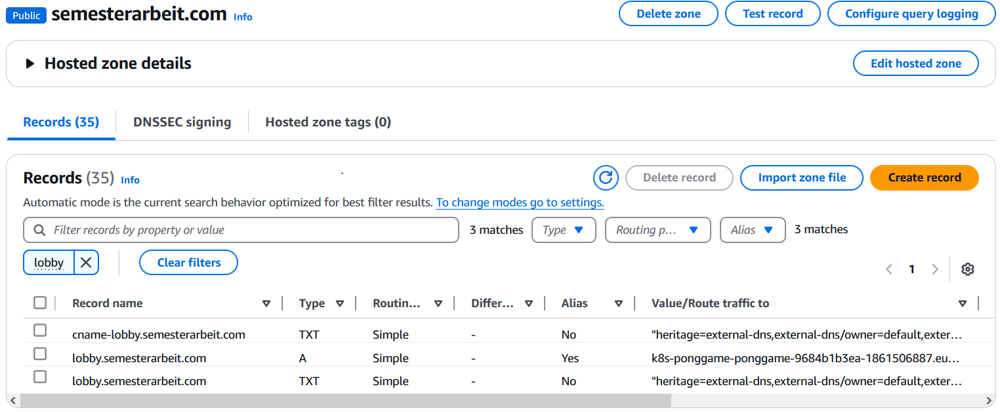

# 3.5.2 External DNS

Um jedem Ingress einen DNS Namen zuzuweisen, nutzen wir das Plugin external-dns auf dem Kubernetes Cluster, welcher direkt Acces auf den Dienst Route 53 von AWS hat. [Mehr zu diesem Plugin auf Ihrem GitHub Repo.](https://github.com/kubernetes-sigs/external-dns)

Konfiguriert werden einzig und allein die Ingresse, mit einer zusätzlichen Annotation.


Das Plugin scannt immerwährend diese Attribute / Labels aller Ingresse ab und erstellt die gewollten DNS entries automatisch falls es Änderungen entdeckt.

```log
time="2025-01-08T13:38:43Z" level=info msg="Applying provider record filter for domains: [semesterarbeit.com. .semesterarbeit.com.]"
time="2025-01-08T13:38:43Z" level=info msg="All records are already up to date"
time="2025-01-08T13:39:43Z" level=info msg="Applying provider record filter for domains: [semesterarbeit.com. .semesterarbeit.com.]"
time="2025-01-08T13:39:43Z" level=info msg="All records are already up to date"
time="2025-01-08T13:40:43Z" level=info msg="Applying provider record filter for domains: [semesterarbeit.com. .semesterarbeit.com.]"
time="2025-01-08T13:40:43Z" level=info msg="Desired change: CREATE cname-room1.semesterarbeit.com TXT" profile=default zoneID=/hostedzone/Z00977171YZXSG129C51P zoneName=semesterarbeit.com.
time="2025-01-08T13:40:43Z" level=info msg="Desired change: CREATE cname-room10.semesterarbeit.com TXT" profile=default zoneID=/hostedzone/Z00977171YZXSG129C51P zoneName=semesterarbeit.com.
time="2025-01-08T13:40:43Z" level=info msg="Desired change: CREATE cname-room2.semesterarbeit.com TXT" profile=default zoneID=/hostedzone/Z00977171YZXSG129C51P zoneName=semesterarbeit.com.
time="2025-01-08T13:40:43Z" level=info msg="Desired change: CREATE cname-room3.semesterarbeit.com TXT" profile=default zoneID=/hostedzone/Z00977171YZXSG129C51P zoneName=semesterarbeit.com.
time="2025-01-08T13:40:43Z" level=info msg="Desired change: CREATE cname-room4.semesterarbeit.com TXT" profile=default zoneID=/hostedzone/Z00977171YZXSG129C51P zoneName=semesterarbeit.com.
time="2025-01-08T13:40:43Z" level=info msg="Desired change: CREATE cname-room5.semesterarbeit.com TXT" profile=default zoneID=/hostedzone/Z00977171YZXSG129C51P zoneName=semesterarbeit.com.
time="2025-01-08T13:40:43Z" level=info msg="Desired change: CREATE cname-room6.semesterarbeit.com TXT" profile=default zoneID=/hostedzone/Z00977171YZXSG129C51P zoneName=semesterarbeit.com.
time="2025-01-08T13:40:43Z" level=info msg="Desired change: CREATE cname-room7.semesterarbeit.com TXT" profile=default zoneID=/hostedzone/Z00977171YZXSG129C51P zoneName=semesterarbeit.com.
time="2025-01-08T13:40:43Z" level=info msg="Desired change: CREATE cname-room8.semesterarbeit.com TXT" profile=default zoneID=/hostedzone/Z00977171YZXSG129C51P zoneName=semesterarbeit.com.
time="2025-01-08T13:40:43Z" level=info msg="Desired change: CREATE cname-room9.semesterarbeit.com TXT" profile=default zoneID=/hostedzone/Z00977171YZXSG129C51P zoneName=semesterarbeit.com.
time="2025-01-08T13:40:43Z" level=info msg="Desired change: CREATE room1.semesterarbeit.com A" profile=default zoneID=/hostedzone/Z00977171YZXSG129C51P zoneName=semesterarbeit.com.
time="2025-01-08T13:40:43Z" level=info msg="Desired change: CREATE room1.semesterarbeit.com TXT" profile=default zoneID=/hostedzone/Z00977171YZXSG129C51P zoneName=semesterarbeit.com.
time="2025-01-08T13:40:43Z" level=info msg="Desired change: CREATE room10.semesterarbeit.com A" profile=default zoneID=/hostedzone/Z00977171YZXSG129C51P zoneName=semesterarbeit.com.
time="2025-01-08T13:40:43Z" level=info msg="Desired change: CREATE room10.semesterarbeit.com TXT" profile=default zoneID=/hostedzone/Z00977171YZXSG129C51P zoneName=semesterarbeit.com.
time="2025-01-08T13:40:43Z" level=info msg="Desired change: CREATE room2.semesterarbeit.com A" profile=default zoneID=/hostedzone/Z00977171YZXSG129C51P zoneName=semesterarbeit.com.
time="2025-01-08T13:40:43Z" level=info msg="Desired change: CREATE room2.semesterarbeit.com TXT" profile=default zoneID=/hostedzone/Z00977171YZXSG129C51P zoneName=semesterarbeit.com.
time="2025-01-08T13:40:43Z" level=info msg="Desired change: CREATE room3.semesterarbeit.com A" profile=default zoneID=/hostedzone/Z00977171YZXSG129C51P zoneName=semesterarbeit.com.
time="2025-01-08T13:40:43Z" level=info msg="Desired change: CREATE room3.semesterarbeit.com TXT" profile=default zoneID=/hostedzone/Z00977171YZXSG129C51P zoneName=semesterarbeit.com.
time="2025-01-08T13:40:43Z" level=info msg="Desired change: CREATE room4.semesterarbeit.com A" profile=default zoneID=/hostedzone/Z00977171YZXSG129C51P zoneName=semesterarbeit.com.
time="2025-01-08T13:40:43Z" level=info msg="Desired change: CREATE room4.semesterarbeit.com TXT" profile=default zoneID=/hostedzone/Z00977171YZXSG129C51P zoneName=semesterarbeit.com.
time="2025-01-08T13:40:43Z" level=info msg="Desired change: CREATE room5.semesterarbeit.com A" profile=default zoneID=/hostedzone/Z00977171YZXSG129C51P zoneName=semesterarbeit.com.
time="2025-01-08T13:40:43Z" level=info msg="Desired change: CREATE room5.semesterarbeit.com TXT" profile=default zoneID=/hostedzone/Z00977171YZXSG129C51P zoneName=semesterarbeit.com.
time="2025-01-08T13:40:43Z" level=info msg="Desired change: CREATE room6.semesterarbeit.com A" profile=default zoneID=/hostedzone/Z00977171YZXSG129C51P zoneName=semesterarbeit.com.
time="2025-01-08T13:40:43Z" level=info msg="Desired change: CREATE room6.semesterarbeit.com TXT" profile=default zoneID=/hostedzone/Z00977171YZXSG129C51P zoneName=semesterarbeit.com.
time="2025-01-08T13:40:43Z" level=info msg="Desired change: CREATE room7.semesterarbeit.com A" profile=default zoneID=/hostedzone/Z00977171YZXSG129C51P zoneName=semesterarbeit.com.
time="2025-01-08T13:40:43Z" level=info msg="Desired change: CREATE room7.semesterarbeit.com TXT" profile=default zoneID=/hostedzone/Z00977171YZXSG129C51P zoneName=semesterarbeit.com.
time="2025-01-08T13:40:43Z" level=info msg="Desired change: CREATE room8.semesterarbeit.com A" profile=default zoneID=/hostedzone/Z00977171YZXSG129C51P zoneName=semesterarbeit.com.
time="2025-01-08T13:40:43Z" level=info msg="Desired change: CREATE room8.semesterarbeit.com TXT" profile=default zoneID=/hostedzone/Z00977171YZXSG129C51P zoneName=semesterarbeit.com.
time="2025-01-08T13:40:43Z" level=info msg="Desired change: CREATE room9.semesterarbeit.com A" profile=default zoneID=/hostedzone/Z00977171YZXSG129C51P zoneName=semesterarbeit.com.
time="2025-01-08T13:40:43Z" level=info msg="Desired change: CREATE room9.semesterarbeit.com TXT" profile=default zoneID=/hostedzone/Z00977171YZXSG129C51P zoneName=semesterarbeit.com.
time="2025-01-08T13:40:43Z" level=info msg="30 record(s) were successfully updated" profile=default zoneID=/hostedzone/Z00977171YZXSG129C51P zoneName=semesterarbeit.com.
time="2025-01-08T13:41:44Z" level=info msg="Applying provider record filter for domains: [semesterarbeit.com. .semesterarbeit.com.]"
time="2025-01-08T13:41:44Z" level=info msg="All records are already up to date"
time="2025-01-08T13:42:45Z" level=info msg="Applying provider record filter for domains: [semesterarbeit.com. .semesterarbeit.com.]"
time="2025-01-08T13:42:45Z" level=info msg="All records are already up to date"
```

Damit wird dann automatisch dass Zonenfile auf dem Route53 Dienst angepasst.



## Installation

Die Installation ist sehr einfach und wird mit folgenden Befehlen bereits erreicht.

Es wird eine neue Policy erstellt, welche es einem Kubernetes Serviceaccount erlaubt Changes im Route53 Dienst zu tätigen.
Anschliessend wird ein einfaches Helm Chart angewendet, mit einigen veränderten Values.

* --set provider=aws
* --set aws.region=eu-central-2
* --set domainFilters[0]=$DNS_ZONE
* --set policy=sync, überprüft laufend die Annotations und entfernt nicht mehr bebötigte.
* --set aws.roleArn=$DNS_ROLE_ARN
* --set serviceAccount.create=false, da der Service Account bereits von uns erstellt wird, darf er nicht überschrieben werden-
* --set serviceAccount.name=external-dns, wie der bereits erstellte Service Account heisst.

```bash
cat > external-dns-policy.conf << EOF
{
  "Version": "2012-10-17",
  "Statement": [
    {
      "Effect": "Allow",
      "Action": [
        "route53:ChangeResourceRecordSets"
      ],
      "Resource": [
        "arn:aws:route53:::hostedzone/*"
      ]
    },
    {
      "Effect": "Allow",
      "Action": [
        "route53:ListHostedZones",
        "route53:ListResourceRecordSets",
        "route53:ListTagsForResource"
      ],
      "Resource": [
        "*"
      ]
    }
  ]
}
EOF
aws iam create-policy --policy-name "AllowExternalDNSUpdatesPolicy" --policy-document file://external-dns-policy.conf --no-cli-pager
DNS_POLICY_ARN=$(aws iam list-policies --query 'Policies[?PolicyName==`AllowExternalDNSUpdatesPolicy`].Arn' --output text)
eksctl create iamserviceaccount --cluster="${CLUSTER_NAME}" --namespace=default --name=external-dns --role-name=AllowExternalDNSUpdatesRole --attach-policy-arn=$DNS_POLICY_ARN --approve --override-existing-serviceaccounts
DNS_ROLE_ARN=$(aws iam get-role --role-name AllowExternalDNSUpdatesRole --query 'Role.[Arn]' --output text)
helm install external-dns oci://registry-1.docker.io/bitnamicharts/external-dns --set provider=aws --set aws.region=eu-central-2 --set domainFilters[0]=$DNS_ZONE --set policy=sync --set aws.roleArn=$DNS_ROLE_ARN --set serviceAccount.create=false --set serviceAccount.name=external-dns
```
