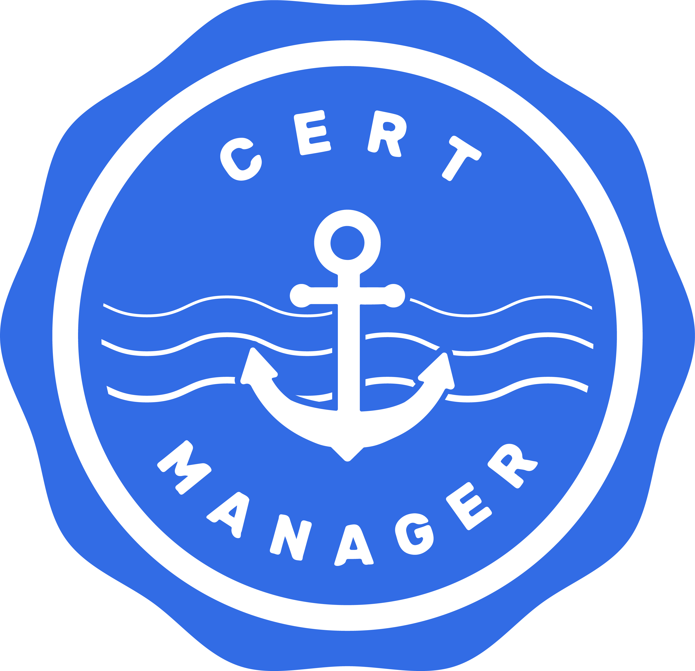

# 3.5.3 Cert Manager

{: style="width: 250px" }

[Quelle Bild - Icons](../anhang/600-quellen.html#615-cert-manager-logo)

Ein grosser Teil der Arbeitszeit ging verloren, beim Versuch mit Cert Manager automatisch Zertifikate für jeden Ingress zu erstellen. Leider scheint dieses Plugin noch nicht ganz fertig programmiert zu sein. Das Zertifikat wurde zwar erstellt, konnte aber nicht vom Ingress genutzt werden, um einen HTTPS Listener anzubieten.

Deshalb wurde auf diese Funktionalität verzichtet und nur HTTP Verkehr erlaubt.

## Installation

Die Installation ist wie auch bei den beiden anderen Plugins dass ganze mit CLI Commands möglich. Zuerst werden die einzelnen Software Komponenten installiert und anschliessend ein Service Account kreiert, mit welchem die Berechtigung gegeben wird, die Route53 Einträge anzupassen.

```bash
# install cert manager
helm install cert-manager cert-manager --repo https://charts.jetstack.io --namespace cert-manager --set crds.enabled=true --create-namespace 
aws iam create-policy --policy-name cert-manager-acme-dns01-route53 --description "This policy allows cert-manager to manage ACME DNS01 records in Route53 hosted zones. See https://cert-manager.io/docs/configuration/acme/dns01/route53" --policy-document file:///dev/stdin <<EOF
{
  "Version": "2012-10-17",
  "Statement": [
    {
      "Effect": "Allow",
      "Action": "route53:GetChange",
      "Resource": "arn:aws:route53:::change/*"
    },
    {
      "Effect": "Allow",
      "Action": [
        "route53:ChangeResourceRecordSets",
        "route53:ListResourceRecordSets"
      ],
      "Resource": "arn:aws:route53:::hostedzone/*"
    },
    {
      "Effect": "Allow",
      "Action": "route53:ListHostedZonesByName",
      "Resource": "*"
    }
  ]
}
EOF
CERT_MANAGER_POLICY_ARN=$(aws iam list-policies --query 'Policies[?PolicyName==`cert-manager-acme-dns01-route53`].Arn' --output text)
eksctl create iamserviceaccount --name cert-manager-acme-dns01-route53 --namespace cert-manager --cluster "${CLUSTER_NAME}" --role-name cert-manager-acme-dns01-route53 --attach-policy-arn "${CERT_MANAGER_POLICY_ARN}" --approve
```

Anschliessend werden die cert-manager Komponenten konfiguriert. So wird der Serviceaccount zugewiesen und die Verbindung zum Cert-Manager Server erstellt. Dieser Server ist von Lets Encrypt gehostet. Von diesen wird auch das CA bereit gestellt, mit welchem die Authentizät der Zertifikate gewährleistet wird.

```bash
cat > rbac.yaml << EOF
apiVersion: rbac.authorization.k8s.io/v1
kind: Role
metadata:
  name: cert-manager-acme-dns01-route53-tokenrequest
  namespace: cert-manager
rules:
  - apiGroups: ['']
    resources: ['serviceaccounts/token']
    resourceNames: ['cert-manager-acme-dns01-route53']
    verbs: ['create']
---
apiVersion: rbac.authorization.k8s.io/v1
kind: RoleBinding
metadata:
  name: cert-manager-acme-dns01-route53-tokenrequest
  namespace: cert-manager
subjects:
  - kind: ServiceAccount
    name: cert-manager
    namespace: cert-manager
roleRef:
  apiGroup: rbac.authorization.k8s.io
  kind: Role
  name: cert-manager-acme-dns01-route53-tokenrequest
EOF
kubectl apply -f rbac.yaml
CERT_MANAGER_ROLE_ARN=$(aws iam get-role --role-name cert-manager-acme-dns01-route53 --query 'Role.[Arn]' --output text)
cat > letsencrypt-issuer.yaml << EOF
apiVersion: cert-manager.io/v1
kind: ClusterIssuer
metadata:
  name: letsencrypt-prod
spec:
  acme:
    server: https://acme-staging-v02.api.letsencrypt.org/directory
    email: marcokaelin@gmx.net
    privateKeySecretRef:
      name: letsencrypt-prod
    solvers:
    - dns01:
        route53:
          region: ${REGION}
          role: ${CERT_MANAGER_ROLE_ARN}
          auth:
            kubernetes:
              serviceAccountRef:
                name: cert-manager-acme-dns01-route53
EOF
kubectl apply -f letsencrypt-issuer.yaml
```

## Zertifikat erstellen

Nach der Installation kann auch diesmal wieder das Zertifikat mit einer Annotation konfiguriert werden. Das wichtigste ist, den Issuer zu konfigurieren, also die konfigurierte Verbindung zu Lets Encrypt. Es wird der Secret Name definiert, als Spiecherort für den Private Key, welcher Cert Manager nutzt und die Informationen darin abspeichert. Der Ingress SOLLTE anschliessend dieses Secret nuttzen.

Leider funktioniert dies aber nicht wie gewollt.

```yaml
metadata:
  annotations:
    cert-manager.io/cluster-issuer: "letsencrypt-prod"
spec:
  tls:
    - hosts:
      - lobby.semesterarbeit.com
      secretName: lobby-semesterarbeit-com
```
