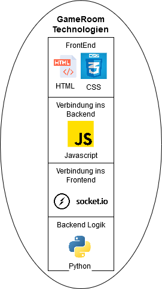

# 3.7.1 Genutzte Technologien

Für den GameRoom werden folgende Technologien verwendet.

* HTML & CSS
* JavaScript
* SocketIO
* Python



## HTML & CSS

Das Frontend, welches mit dem Browser aufgerufen wird, nutzt HTML und CSS. Es gibt dazu ein Template in diesen beiden Sprachen, welches von Python-FLASK an den Benutzer gesendet wird. Erreichbar sind die einzelnen GameRooms unter diesen Domains:

* <http://gameroom1.semesterarbeit.com>
* <http://gameroom2.semesterarbeit.com>
* <http://gameroom3.semesterarbeit.com>
* <http://gameroom4.semesterarbeit.com>
* <http://gameroom5.semesterarbeit.com>
* <http://gameroom6.semesterarbeit.com>
* <http://gameroom7.semesterarbeit.com>
* <http://gameroom8.semesterarbeit.com>
* <http://gameroom9.semesterarbeit.com>
* <http://gameroom10.semesterarbeit.com>

{: .notice }
Nur solange der CLuster läuft und die Pods laufen.

## JavaScript

Im Teplate wird das JavaScript Modul socketio genutzt, um mit dem Backend Server zu kommunizieren. Um das ganze einzurichten, wird zuerst das Modul aufgerufen und anschliessend das Backend definiert. Das Modul nutzt als Standard für den Socket die Quelle von wo das Template angefordert wurde, in diesem Fall benutzt der Socket also den GameRoom.

```javascript
const socket = io();
```

Der Socket kann anschliessend genutzt werden um Aufrufe an das Backend zu senden oder Aufrufe zu empfangen.

```javascript
socket.emit("update_username", { username: event.data.data });
socket.on("player_id", (id) => { playerID = id });
```

## SocketIO auf Python

Das Backend nutzt das `flask_socketio` Modul um mit dem Frontend zu kommunizieren.

```python
from flask_socketio import SocketIO, emit

@socketio.on("update_username")
def update_username(data):
    if request.sid in players.keys():
        username = data["username"]
        players[request.sid]["username"] = username
        game_state["scores"][f"player{players[request.sid]["playerId"]}"]["username"] = username
....
emit("player_id", player_id, room=request.sid)
```

Mit diesen Calls wird die Verbindung laufend aktualisiert und Informationen gesendet.

## Python Backend

Python nutzt FLASK um einen Webserver anzubieten. Wie bereits vorhin erwähnt, nutzt Flask anschliessend das SocketIO Modul um eine laufende Verbindung mit dem Frontend zu erstellen.

Damit diese Verbindung aber laufend aktualisiert wird, gibt es den Background Task. Dieser ist ein offener Loop, welcher immer wieder Daten mit dem Frontend aktualisiert.

```python
socketio.start_background_task(game_loop)

    def game_loop():
        ongoing_game = False
        while True:
            if len(players.keys()) == 2:
                if ongoing_game:
                    update_game(game_state_dict=game_state, socketio_object=socketio)
                else:
                    ongoing_game = True
                    reset_game_scores(game_state_dict=game_state)
                    update_game(game_state_dict=game_state, socketio_object=socketio)
            else:
                pass

            socketio.sleep(0.03)  # 30 FPS
```
